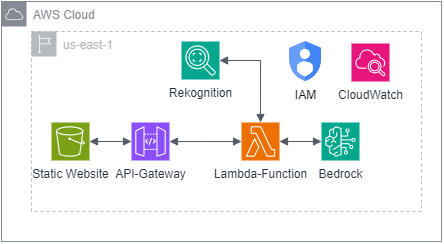
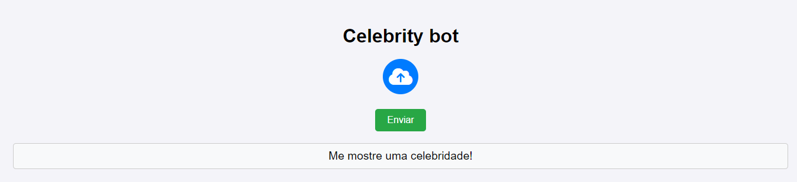
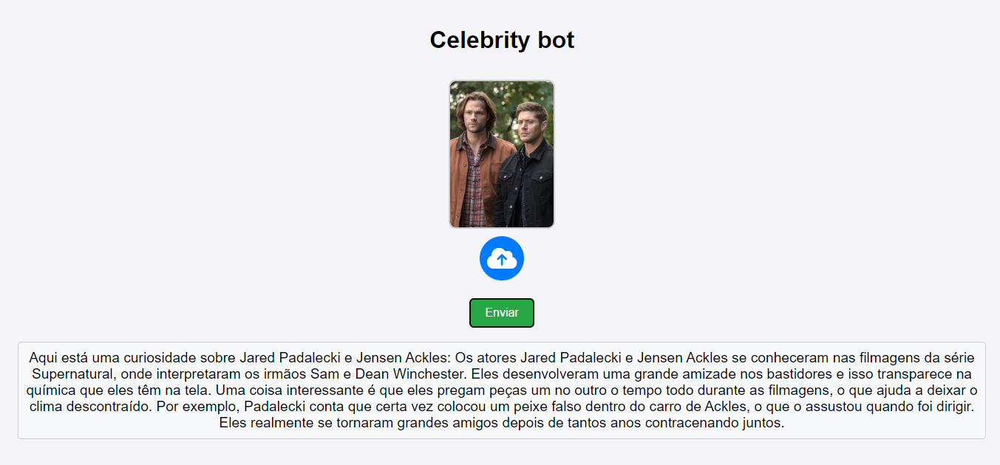

# Celebrity bot

Uma ferramenta que reconhece e conta uma curiosidade sobre celebridades encontradas na imagem.

## Índice

1. [Visão Geral do Projeto](#visão-geral-do-projeto)
2. [Pré-requisitos](#pré-requisitos)
3. [Configuração do Ambiente](#configuração-do-ambiente)
4. [Arquitetura AWS](#arquitetura-aws)
5. [Implantação](#implantação)
6. [Uso](#uso)
7. [Custos da infraestrutura](#custos-da-infraestrutura)


## Visão Geral do Projeto

Este projeto consiste em um bot que reconhece celebridades em imagens e fornece curiosidades sobre elas. Utilizando serviços da Amazon Web Services (AWS) para gerenciamento de infraestrutura e Terraform para orquestrar a infraestrutura como código (IaC), a solução oferece automação eficiente, escalável e fácil de manter. A implementação permite reutilização em diferentes ambientes e possibilita integração contínua com outras ferramentas da AWS, garantindo uma arquitetura robusta e otimizada. 

## Pré-requisitos

1. **Conta AWS**.
2. **Ferramentas necessárias**:
   - [AWS CLI](https://aws.amazon.com/cli/)
   - [Terraform](https://www.terraform.io/)

## Configuração do Ambiente

### Passo 1: Clonar o Repositório

```bash
git clone https://github.com/isaacfvi/Celebrity-bot.git
cd Celebrity-bot
```

### Passo 2: Configuração AWS

Além de instalar e configurar o AWS CLI, é necessário criar um usuário IAM com permissões necessárias para gerenciar todos os recursos do projeto.

As credenciais de acesso (Access Key ID e Secret Access Key) devem ser configuradas no AWS CLI, incluindo a definição da região onde os recursos serão provisionados. Para usuários no Brasil, recomenda-se utilizar a região us-east-1, devido à maior disponibilidade de serviços e melhores preços.

Além disso, também é necessário criar um bucket s3 na região us-east-1 para armazenar o estado da infraestrutura remota, importante para projetos de infraestruturas em equipe.

## Arquitetura AWS



### Recursos Utilizados

Bucket S3: Armazena o estado remoto do Terraform e serve como local para hospedar o site estático.

API Gateway: Gerencia e disponibiliza a API que invoca funções do AWS Lambda.

AWS Lambda: Executa funções em Python para realizar chamadas ao Amazon Rekognition e ao modelo do Bedrock.

Rekognition: Realiza o reconhecimento de celebridades nas fotos enviadas.

Bedrock: Conecta-se ao modelo LLM [Claude v2](https://www.anthropic.com/news/claude-2), disponibilizado no marketplace pela Anthropic. Fornecer curiosidades sobre as celebirdades encontradas pelo Rekognition.

IAM: Garante permissões para o lambda acessar outros recursos.

CloudWatch: Monitora e guarda logs gerados pelas chamadas do API Gateway.

## Implantação

### Passo 1: Provisionando infraestrutura

Navegue até a pasta terraform e inicie a configuração do Terraform com o comando:

```bash
cd ./terraform/
terraform init
```

Durante a inicialização, o Terraform solicitará informações sobre o bucket S3 criado nas configurações de ambiente e o caminho para armazenar o estado remoto. Forneça esses detalhes para configurar o backend remoto corretamente.

### Passo 2: Subindo infraestrutura

Para subir a infraestrutura, utilize os seguintes comandos:

```bash
terraform apply -out="plan.out
terraform apply "plan.out"
```

O primeiro comando cria um plano de execução e solicita a região onde a infraestrutura será provisionada. O segundo comando aplica o plano e aprova a criação dos recursos definidos.

Por fim, a estrutura estará pronta e será retornado a url da api gerada e uma página para acessar a aplicação.

## Uso

### Website
Ao acessar o website estático:

Selecione uma Imagem cliquando no ícone de nuvem e escolha uma imagem do seu sistema.



Envie a Imagem cliquando no botão "Enviar" para processar a imagem. Aguarde enquanto o bot realiza o reconhecimento e gera o texto correspondente.



### API

A API tem uma rota padrão "https://api_url/" com o método POST.

- envio da requisição:
```json
   {
      "imagem": "imagem-base64encoded"
   }
```

- retorno da requisição:
```json
   {
      "status": 200,
      "body": {
          "fun_fact": "text"
      }
   }
```

### Custos da infraestrutura

Valor médio por mês da aplicação considerando 10 usos diários

- Bucket S3: USD 0,00

- API Gateway: USD 0,00

- AWS Lambda: USD 0,00

- Rekognition: USD 0,30

- Bedrock: USD 1,20

- IAM: USD 0,00

- CloudWatch: USD 0,00

Valor total mensal: USD 1,50
